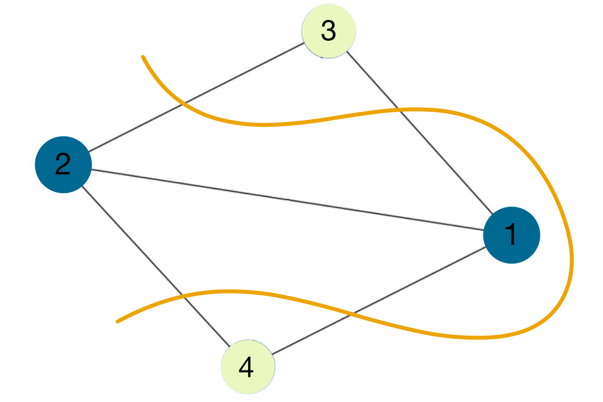
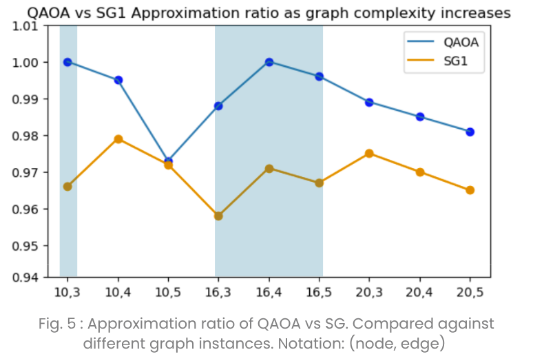
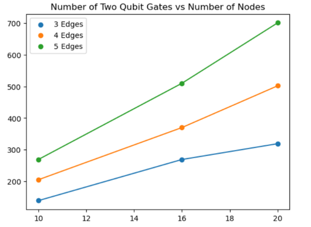

# Quantum Approximation Optimization Ratio vs. Classical Heuristic

## Research Question

How does the solution quality of the standard Quantum Approximate Optimization Algorithm (QAOA) and Sahni-Gonzalez Algorithm compare in MaxCut instances on small, 3-, 4-, and 5-regular graphs?

We tested unweighted graphs with 10, 16, and 20 nodes, with instances of 3-, 4-, and 5-regular graphs, in order to assess how the performance of QAOA scaled as the number of edges per node increased.

## Terms and Definitions 

**Graph** - A collection of nodes with lines or "edges" connecting two nodes. These edges can have values associated with them, called weights.

**Regular Graph** - A graph where every node has the same number of edges connecting them to other nodes

**Hamiltonian** - An operator representing the total energy of a physical system

**Heuristic Algorithm** - An algorithm that uses guesses and approximations to arrive at an approximate answer much faster than a traditional algorithm

## Motivation

Optimization problems are commonplace in real-life, with broad applications in areas such as marketing, finance, and engineering. Many of these optimization problems can be formatted as a Max-Cut problem. Finding an exact solution to these Max-Cut problems becomes exponentially more difficult as the complexity of the graphs increases; however, this means that only approximate solutions can be found for graphs above a certain complexity. QAOA offers a potential alternative to the classical approximation algorithms and could have the potential to surpass the effectiveness of classical approximation ratios if QAOA is able to effectively scale to the complexity of modern-day applications of the Max-Cut problem.

## Max-Cut
Max-Cut is a type of Quadratic Unconstrained Binary Optimization Problem (QUBO). QUBOs represent optimization problems in which the goal is to find a minimum or maximum of a quadratic function with binary variables (0s and 1s) and no constraints. These are the types of problems that the Quantum Approximation Optimization Algorithm (QAOA) aims to solve. Among QUBOs like the traveling salesman problem, they can all be represented by the Max-Cut problem, which makes Max-Cut a popular problem used to benchmark the capabilities of algorithms like QAOA.

MaxCut is a problem within graph theory that aims to partition nodes within a graph into two subgroups, such that the line drawn to divide the subgroups intersects a maximum of edges connecting nodes, as seen in the image below. This problem has a wide range of applications in analyzing social networks, circuit layout, and portfolio management.

## Algorithms

### Classical Brute-Force Algorithm
The classical brute-force algorithm is an exact algorithm, meaning it finds the true optimal result of the optimization problem. This contrasts with the approximate methods of the previously mentioned Sanhi-Gonzalez Algorithm and Quantum Approximation Optimization Algorithm.

The brute-force algorithm iteratively tests every possible solution of the Max-Cut problem for the given graph to find the true optimal solution; the downside, however, is the algorithm's complexity of $O(2^n)$, making it impossible to use for more complicated graphs.

### Sahni-Gonzalez Algorithm
The Sahni-Gonzalez algorithm is an algorithm that starts from a single pair of nodes and evaluates the connections of each node to the starting pair to approximate an optimal cut with significantly fewer computations. The algorithm works like this: 

Start at the highest weight edge

↓

         

Nodes connected to the edges are the starting pair

↓

         

Split the pair into two sets 
 

↓
 
         

Check next node's connection to each of the starting nodes
  

↓
 
         

Put the node into the set opposite the highest connection starting node

↓

         

Repeat for the rest of the nodes 
 

Because the algorithm checks each node and edge once, it has a complexity of $O(n + E)$, where n is the number of nodes and E is the number of edges. This complexity scales much better than the brute-force algorithm and allows it to be effectively used for graphs with hundreds of nodes.

### Quantum Approximation Optimization Algorithm
The Quantum approximation optimization algorithm (QAOA) is a hybrid quantum-classical algorithm and, as mentioned above, is used to find approximate solutions for QUBO problems. The QAOA is a specific type of Variational Quantum Eigensolver, a branch of algorithms used to find the ground state energy of a system's Hamiltonian. QAOA finds the ground state of a cost function Hamiltonian, where the ground state energy represents the optimized value of the cost function associated with a QUBO problem. The circuit for the QAOA is composed of two parts: the cost Hamiltonian and the mixer Hamiltonian. The cost Hamiltonian consists of rotation gates characterized by the parameter $\gamma$, and is used to guide the system closer to the optimal solution. The mixer Hamiltonian consists of a series of X-gates characterized by the parameter $\beta$, and is used to expand the solution space and stop the algorithm from getting stuck. A classical optimizer is then used to evaluate the circuits and find the optimal values for $\gamma$ and $\beta$. The circuit is then run a final time using the optimal parameters, and the output from the circuit is an approximation of the optimized cost function. 
## Measure of Merit

### Solution Quality - Approximation Ratio
The approximation ratio is a measure of the solution quality produced by an algorithm as it calculates a value for how closely the resulting solution matches the true optimal solution. This metric was chosen for its ablity to consider the entire sample of the dataset. The formula of the approximation ratio is $A(I)/OPT(I)=\alpha$, where $A(I)$ is the algorithm output and $OPT(I)$ is the optimal solution.

### Resource Use - Gate Count
Typical measures of an algorithm's resource usage include runtime and energy usage. However, when dealing with quantum algorithms, these measures can be difficult to access or unrepresentative of the algorithm. While energy usage is often seen as the most accurate report of an algorithm's resource usage, it is difficult to access on the typical public user interface of IBM Quantum. Our project opted for the use of quantum simulations instead of true quantum hardware, meaning the quantum behaviors of quantum computing were emulated on a classical processor. Because these simulations require additional classical computation to model quantum effects, the runtime of the simulated quantum algorithm does not accurately reflect the runtime the algorithm would have on a real quantum computer.

Instead of energy usage and runtime, our project measured the total gates and two-qubit gates utilized within the quantum algorithm. This measure can represent the efficiency of the algorithms. Additionally, current quantum devices have limited qubit gate counts; measuring gate counts can be used to determine the amount of gate resources being utilized by the algorithm.

## Methods

### Overview
We randomly generated graphs with 10, 16, and 20 nodes, with each number of nodes having 3 instances with 3, 4, and 5 connections on each node (example graph shown below). To measure the solution quality of the QAOA and SG algorithm, we implemented a brute force algorithm that found the optimal cut of each graph, comparing it to the output of both the QAOA and the SG algorithm. Additionally, we measured the number of two-qubit gates in each circuit that was created and averaged them across the 30 tests we ran of each graph to get an accurate idea of the average number of circuits needed to run the QAOA.

### Experiment Details
Quantum Platform: We tested the QAOA on an IBM Quantum Device Emulator, which aims to reproduce the capabilities of the real quantum device by limiting qubit connectivity to that of the real device and simulating quantum noise. Specifically, we used Sherbrooke, IBM's 127-qubit simulated backend.

### Code Outline
1. Created a random graph with the set graph features (ex. 10 nodes and 5-regular graph).
2. Find the approximate Max-Cut solution using QAOA.
4. Find the approximate Max-Cut solution using the Sahni-Gonzalez Algorithm.
5. Find the true optimal Max-Cut solution using a classical Brute-Force Algorithm.
6. Calculate the approximation ratio of QAOA and the Sahni-Gonzalez Algorithm.
7. Record the graph instance, approximation ratios, QAOA gate count, QAOA circuit, and QAOA solution distribution.

Use a for-loop to run steps 1-6, 30 times for each set of graph features.
| Nodes | Edges Per Node |
|-------|----------------|
| 10    | 3              |
| 10    | 4              |
| 10    | 5              |
| 16    | 3              |
| 16    | 4              |
| 16    | 5              |
| 20    | 3              |
| 20    | 4              |
| 20    | 5              |

## Results
We found that the QAOA consistently found equivalent or slightly better quality solutions than the SG algorithm, with the level of solution quality staying relatively consistent from 0.97-0.99 for all the graphs. And the SG algorithm ranged from 0.98-0.96. The solution quality appears to decrease linearly over the 20 node graphs, but we are unsure if this is a real decrease in the solution quality or just the solution quality range appearing to decrease. More testing on higher node graphs would be required to confirm this.

Additionally, we found that the number of two-qubit gates required to run the QAOA circuit increases in a roughly linear pattern, with the number of gates increasing alongside the number of connections as well. The number of two-qubit gates required more than doubled when going from 3-5 connections per node, indicating poor connection-wise scalability.

The synthesized data can be found in [data sheets](https://docs.google.com/spreadsheets/d/1Oxomdw1UGmlCHMsuy2j9GH-BQ797fcEJhxUDFdoc-YQ/edit?usp=sharing). 
The raw data from each Max-Cut iteration conducted can be found in the following [google file](https://drive.google.com/drive/folders/1HOsF8niU69tRh6PZ0DAb73QZxZev1Twi?usp=sharing)

## Implications and Conclusion
While the QAOA appears to have a slight advantage in solution quality, it is severely hampered by the issue of scalability. The largest factor is the number of qubits required, since every additional node requires another qubit in the circuit. Current quantum technology has around 120-150 qubits available, which limits the possible uses of QAOA to smaller-scale instances. Additionally, the number of two-qubit gates that can be supported is around 5000, which again limits the use case to instances with fewer connections, since the number of two-qubit gates required increases as more connections are added. For now, classical algorithms remain the best option for real-world applications, but with the advancement of quantum technology, QAOA could be a competitive option for binary optimization problems.

## Future Work

Our project tested a limited range of small Max-Cut instances, which can potentially overlook greater overarching patterns, so graphs with node counts higher than 20 should be tested. Due to monetary limitations, this experiment was conducted using quantum emulators instead of real quantum hardware. Future works can build upon and confirm our findings through their replications on equivalent quantum hardware. Additionally, there are different versions of QAOA that can be explored, such as QAOA in QAOA and warm-started QAOA. These versions appear to try to improve the scalability of QAOA and show promise in achieving greater overall performance compared to standard QAOA.

## References

1. Zeqiao Z, Yuxuan D, Xinmei T, Dacheng T, QAOA-in-QAOA: solving large-scale MaxCut problems on small quantum machines (2022),  [arxiv](https://arxiv.org/abs/2205.11762)
2. Daniel P, Variational Quantum Algorithms for Combinatorial Optimization (2024), [arxiv](https://doi.org/10.48550/arXiv.2407.06421)
3. Ishan P, Akhil A, Hybrid Quantum-HPC Solutions for Max-Cut: Bridging Classical and Quantum Algorithms (2024), [arxiv](https://doi.org/10.48550/arXiv.2410.15626)
4. J. A. M, Kristel M, Toward a linear-ramp QAOA protocol: evidence of a scaling advantage in solving some combinatorial optimization problems (2025), npj quantum information, [nature](https://www.nature.com/articles/s41534-025-01082-1)
5. David B et al, Towards Robust Benchmarking of Quantum Optimization Algorithms (2025), [IEEE](10.1109/QCE60285.2024.11030870)
6. Micheal X, David W, Improved approximation algorithms for maximum cut and satisfiability problems using semidefinite programming (1995), [JACM](https://doi.org/10.1145/227683.227684)
7. IBM quantum platform, Quantum approximate optimization algorithm (2024), [IBM](https://quantum.cloud.ibm.com/docs/en/tutorials/quantum-approximate-optimization-algorithm)

---

> The research poster for this project can be found in the [BeyondQuantum Proceedings 2026](https://thinkingbeyond.education/beyondquantum_proceedings_2026/).
